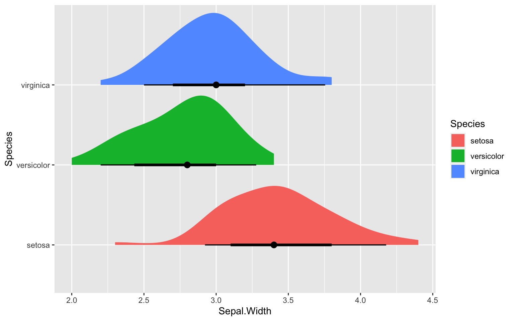
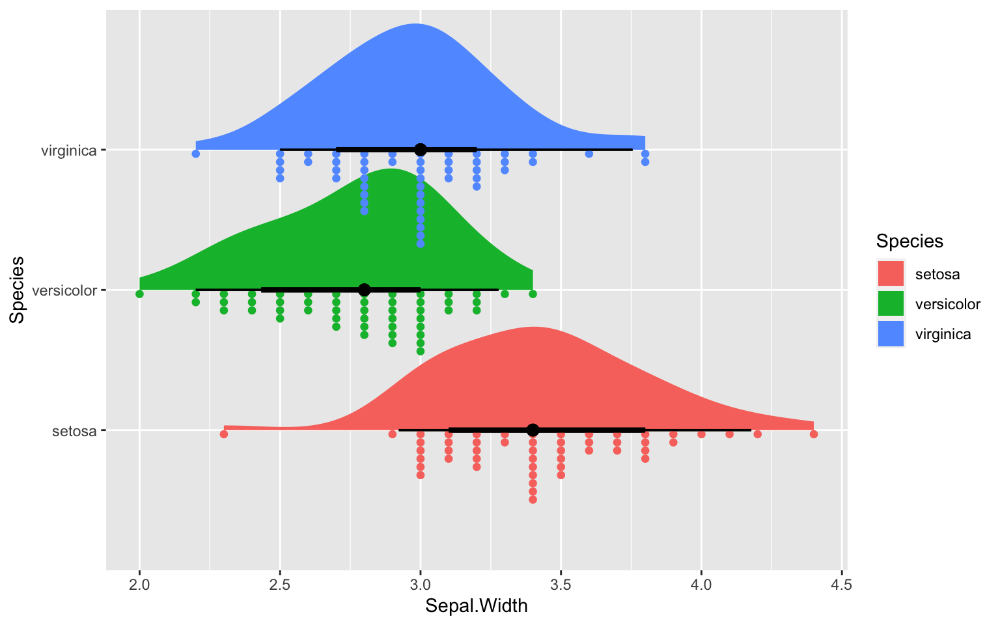
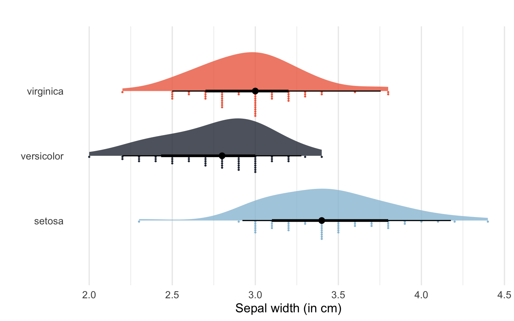
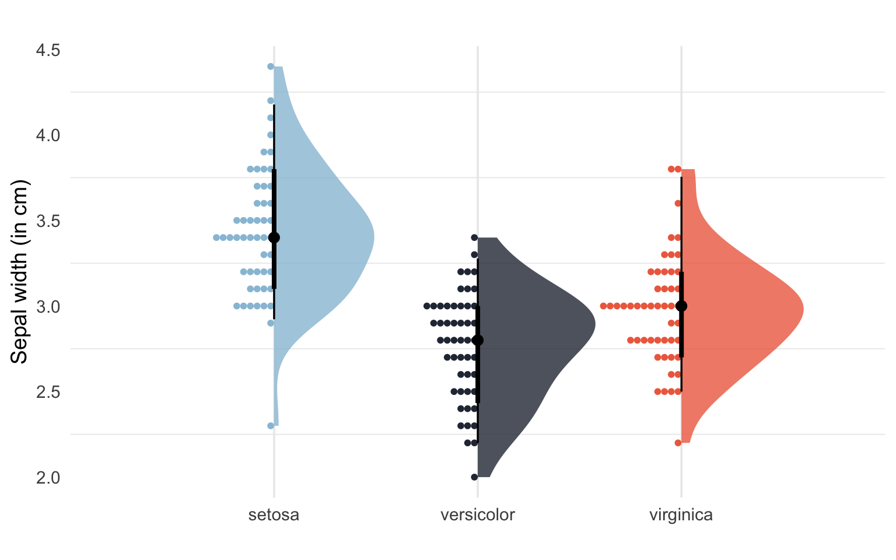
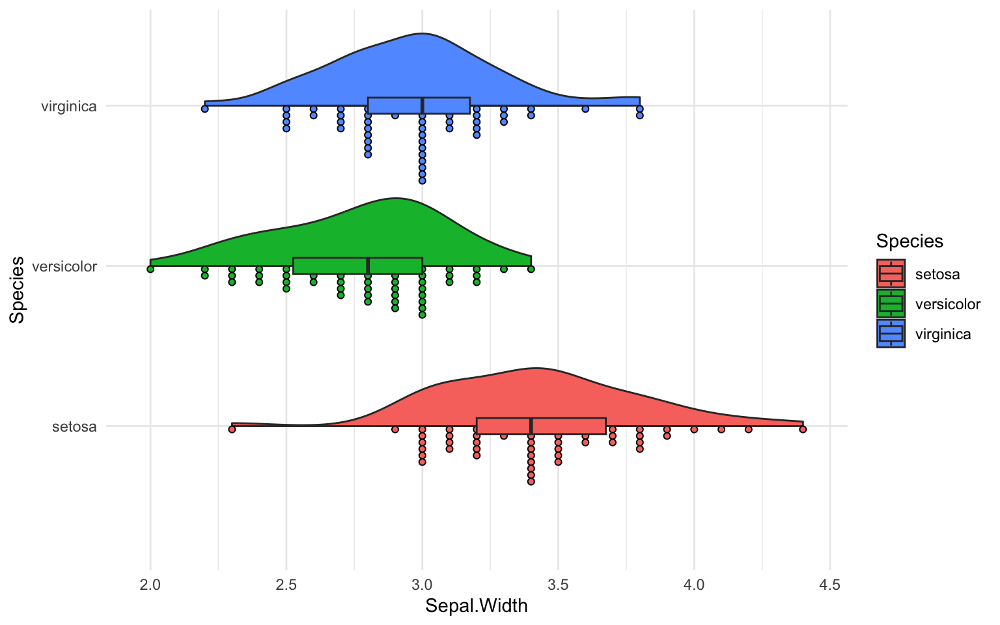
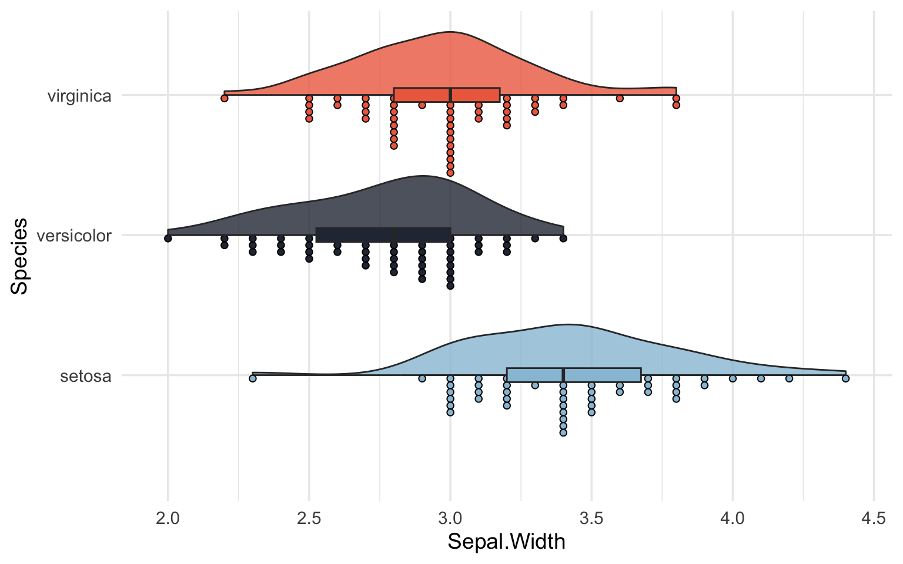

## What are raincloud plots and why use them?

Raincloud plots are very cool, informative and transparent visual representations of your data. Barplots and boxplots have been widely criticized as they do not show underlying patterns in the data (distribution, raw data). Raincloud plots have emerged as a way of overcoming such challenges -- we can visualize raw data points, the distribution and summary statistics simultaneously. In my opinion it is more intuitive and transparent, and I have to add, it also looks beautiful. Lets create one!

## Raincloud plot tutorial using R

**Packages and data**

We will use ggplot2 which is also part of [the tidyverse](https://www.tidyverse.org/), and the package [ggdist](https://mjskay.github.io/ggdist/index.html) which is designed for visualizing distributions and uncertainty (available on CRAN). There are several other packages and functions out there. For instance, [raincloudplots](https://github.com/jorvlan/raincloudplots) which is great for repeated measures data (but is not ggplot2 compatible), or geom_flat_violin() and geom_split_violin() which are part of the [introdatacviz package](https://github.com/PsyTeachR/introdataviz) and [PupillometryR package](https://cran.r-project.org/web/packages/PupillometryR/index.html). Lets first create a raincloud plot using ggdist, then later using the functions as part of the introdataviz package. Lets load the packages:

``` r
#### ---- Load packages ---- ####
library(ggdist)
library(introdataviz)
library(tidyverse)
```

For this tutorial we will be using the Iris dataset again. The dataset consists of measurements of different features of three Iris species -- setosa, virginica, and versicolor. A fun fact is that there are up to 280 species of Iris on the planet. The measurements include the length and width (in cm) of the sepals and petals of the flower. In case you are confused, look at the image below for what petals and sepals are, borrowed from [ScienceFacts.net](https://www.sciencefacts.net/sepals.html).

  
This is how you load the data:

``` r
#### ---- Load data ---- ####
data(iris)
```

Lets have a look at the first rows:

``` r
head(iris)
```

      Sepal.Length Sepal.Width Petal.Length Petal.Width Species
    1          5.1         3.5          1.4         0.2  setosa
    2          4.9         3.0          1.4         0.2  setosa
    3          4.7         3.2          1.3         0.2  setosa
    4          4.6         3.1          1.5         0.2  setosa
    5          5.0         3.6          1.4         0.2  setosa
    6          5.4         3.9          1.7         0.4  setosa

And also lets have a look at some descriptives:

``` r
summary(iris)
```

      Sepal.Length    Sepal.Width     Petal.Length    Petal.Width   
     Min.   :4.300   Min.   :2.000   Min.   :1.000   Min.   :0.100  
     1st Qu.:5.100   1st Qu.:2.800   1st Qu.:1.600   1st Qu.:0.300  
     Median :5.800   Median :3.000   Median :4.350   Median :1.300  
     Mean   :5.843   Mean   :3.057   Mean   :3.758   Mean   :1.199  
     3rd Qu.:6.400   3rd Qu.:3.300   3rd Qu.:5.100   3rd Qu.:1.800  
     Max.   :7.900   Max.   :4.400   Max.   :6.900   Max.   :2.500  
           Species  
     setosa    :50  
     versicolor:50  
     virginica :50  
                    
                    
                    

**Basic raincloud using ggdist**  
Let us first make a basic raincloudplot using stat_slab() and stat_dotsinterval() from *ggdist*.
I recommend you play around with the available functions like stat_slab(), stat_dotsinterval(), stat_halfeye, and geom_slabinterval(). Check out this [documentation](https://mjskay.github.io/ggdist/articles/slabinterval.html).

``` r
ggplot(iris, aes(x = Sepal.Width, y = Species, fill = Species)) +
  stat_halfeye()
```



Its a great start. We want the individual datapoints coming down like rain from the cloud (that's kind of the point as it is called a raincloud after all). So lets add that, shall we?

``` r
ggplot(iris, aes(x = Sepal.Width, y = Species, fill = Species)) +
  stat_halfeye(position = position_dodge(width = 10)) +
   stat_dotsinterval(side = "bottom",
                    scale = 0.7,
                    slab_size = NA) 
```



**Pimping the ggdist raincloud plot**  
Lets pimp this one up like this (adding custom colors, removing legend etc):

``` r
# Set custom color scheme 
custom_palette <- c("setosa" = "#98c1d9", "versicolor" = "#293241","virginica" = "#ee6c4d")

ggplot(iris, aes(x = Sepal.Width, y = Species, fill = Species))+
  stat_slab(aes(thickness = stat(pdf*n)), 
            scale = 0.6, alpha = 0.8) +
  stat_dotsinterval(side = "bottom",
                    scale = 0.4,
                    slab_size = NA, position = "dodge") + 
  scale_fill_manual(values = custom_palette) +
  scale_color_manual(values = custom_palette) +
  labs(title="",
       x = "Sepal width (in cm)", 
       y = "") +
  theme_minimal(base_size = 14) + 
  #coord_flip()+
  theme(legend.position = "none", 
        panel.grid.major.y = element_blank())
```

    Warning: `stat(pdf * n)` was deprecated in ggplot2 3.4.0.
    ℹ Please use `after_stat(pdf * n)` instead.



Much better! We can also change the orientation of the plot by adding coord_flip():

``` r
# Change orientation using coord_flip()
ggplot(iris, aes(x = Sepal.Width, y = Species, fill = Species))+
  stat_slab(aes(thickness = stat(pdf*n)), 
            scale = 0.6, alpha = 0.8) +
  stat_dotsinterval(side = "bottom",
                    scale = 0.4,
                    slab_size = NA, position = "dodge") + 
  scale_fill_manual(values = custom_palette) +
  scale_color_manual(values = custom_palette) +
  labs(title="",
       x = "Sepal width (in cm)", 
       y = "") +
  theme_minimal(base_size = 14) + 
  coord_flip()+
  theme(legend.position = "none", 
        panel.grid.major.y = element_blank())
```



**Basic raincloud plot using introdataviz functions**

Lets make a raincloudplot using introdataviz functions like geom_flat_violin():

``` r
ggplot(iris, aes(x = Species, y = Sepal.Width, fill = Species)) +
  geom_flat_violin() +
  geom_dotplot(binaxis = "y", stackdir = "down", dotsize = 0.3) +
  geom_boxplot(width = 0.1, outlier.shape = NA) +
  coord_flip() + 
  theme_minimal()
```

    Bin width defaults to 1/30 of the range of the data. Pick better value with
    `binwidth`.

    Warning: Using the `size` aesthetic with geom_polygon was deprecated in ggplot2 3.4.0.
    ℹ Please use the `linewidth` aesthetic instead.



**Pimped raincloud plot using introdataviz functions**  
Let us fix this by adding custom colors and other nice aesthetics.

``` r
custom_palette <- c("setosa" = "#98c1d9", "versicolor" = "#293241","virginica" = "#ee6c4d")

ggplot(iris, aes(x = Species, y = Sepal.Width, fill = Species)) +
  geom_flat_violin(alpha = 0.8) +
  geom_dotplot(binaxis = "y", stackdir = "down", dotsize = 0.3) +
  geom_boxplot(width = 0.1, outlier.shape = NA) +
  scale_fill_manual(values = custom_palette) +
  scale_color_manual(values = custom_palette) +
  coord_flip() + 
  theme_minimal(base_size = 14) + 
  theme(legend.position = "none")
```

    Bin width defaults to 1/30 of the range of the data. Pick better value with
    `binwidth`.



That was it! Hope you found it useful as an introduction to raincloud plots using R.

## Further reading and resources

-   This paper by [Allen et al., (2021)](https://wellcomeopenresearch.org/articles/4-63/v2)
-   This blogpost by ggplot2 expert [Cédric Scherer](https://www.cedricscherer.com/2021/06/06/visualizing-distributions-with-raincloud-plots-and-how-to-create-them-with-ggplot2/)
-   This data visualization post from [introdataviz](https://psyteachr.github.io/introdataviz/advanced-plots.html#raincloud-plots)
